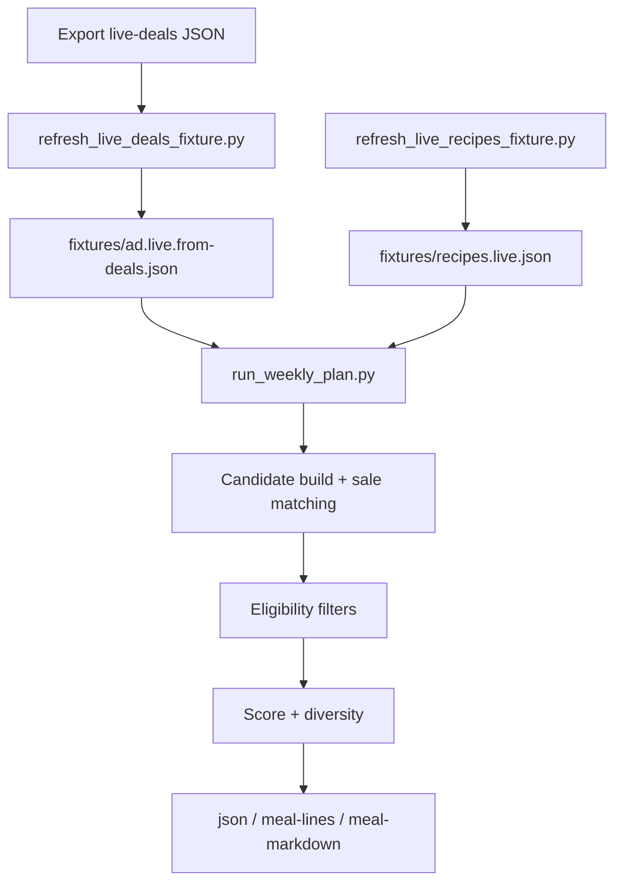

# Grocery Weekly Menu Skill

Generate a weekly set of 10 healthy/easy meals from Kroger sale context with diversity, quality gates, and markdown/JSON output.

## What It Does

- Enforces filters: no Asian cuisine, no beans, no fennel
- Requires rated recipes (`>=4.0`) with vote-weighted scoring
- Balances diversity across proteins, cuisines, and source domains
- Supports fixture, web, and Playwright-backed recipe/ad modes
- Produces JSON, plain meal lines, or markdown meal links

## Setup

From `grocery-weekly-menu-skill/`:

```bash
./scripts/setup.sh
```

Manual equivalent:

```bash
npm install
npx playwright install chromium
python3 -m unittest discover -s tests -p "test_*.py"
```

## Weekly Workflow (Recommended)

1) Export Kroger `shoppable-weekly-deals` JSON from browser DevTools to `fixtures/live-deals.json`

2) Run weekly refresh + markdown output:

```bash
python3 -m scripts.refresh_live_deals_fixture && \
python3 -m scripts.refresh_live_recipes_fixture --mode playwright --target-count 100 --allow-shortfall && \
python3 -m scripts.run_weekly_plan \
  --ad-mode fixture \
  --ad-fixture fixtures/ad.live.from-deals.json \
  --search-mode fixture \
  --recipe-fixture fixtures/recipes.live.json \
  --target-count 10 \
  --quality-gate \
  --output-format meal-markdown
```

## Core Commands

Run planner from sample fixtures:

```bash
python3 -m scripts.run_weekly_plan \
  --recipe-fixture fixtures/recipes.sample.json \
  --ad-fixture fixtures/ad.sample.json \
  --target-count 10
```

Switch output format:

```bash
--output-format json
--output-format meal-lines
--output-format meal-markdown
```

Web mode with fixture fallback:

```bash
python3 -m scripts.run_weekly_plan \
  --ad-mode web \
  --search-mode web \
  --web-fallback-to-fixture \
  --recipe-fixture fixtures/recipes.sample.json \
  --manual-fallback-fixture fixtures/ad.sample.json \
  --target-count 10
```

Validate inputs only:

```bash
python3 -m scripts.run_weekly_plan --validate-only --search-mode fixture --recipe-fixture fixtures/recipes.sample.json --ad-fixture fixtures/ad.sample.json
```

## Code Flow



### Script Responsibilities

- `scripts.refresh_live_deals_fixture.py`: convert exported deals JSON into normalized ad fixture
- `scripts.refresh_live_recipes_fixture.py`: fetch/parse live recipes, exclude last-week URLs, write fixture
- `scripts.run_weekly_plan.py`: load fixtures/adapters, plan meals, emit output formats

### Data Shapes (High Level)

- Ad fixture item: `{ "name": "...", "price_text": "...", "category": "..." }`
- Recipe fixture item: `{ "title","url","cuisine","protein","ingredients","rating","vote_count","prep_minutes","healthy" }`
- Meal output item: `{ "title","url","rating","vote_count","score","cuisine","protein","sale_item_matches" }`

## Troubleshooting

- `written=0` on recipe refresh:
  - retry Playwright mode and ensure browser install:
  - `npm install playwright && npx playwright install chromium`
- `used_backfill_from_excluded=true`:
  - novelty pool was exhausted; script reused current results to avoid empty fixture
- low recipe count:
  - keep `--allow-shortfall` enabled so planner still runs
  - rerun later or on another network if domains are timing out/blocked

Compact healthy refresh example:

```json
{
  "status": "ok",
  "mode": "playwright",
  "target_count": 100,
  "written": 72,
  "excluded_from_last_week": 24,
  "used_backfill_from_excluded": false,
  "allow_shortfall": true
}
```

## Configuration Notes

- Default location id is `01100459` (override with `--location-id`)
- Keep `fixtures/kroger_extra_headers.live.json` local only; use `fixtures/kroger_extra_headers.template.json` as the safe starter
- `--search-mode fixture` requires `--recipe-fixture`
