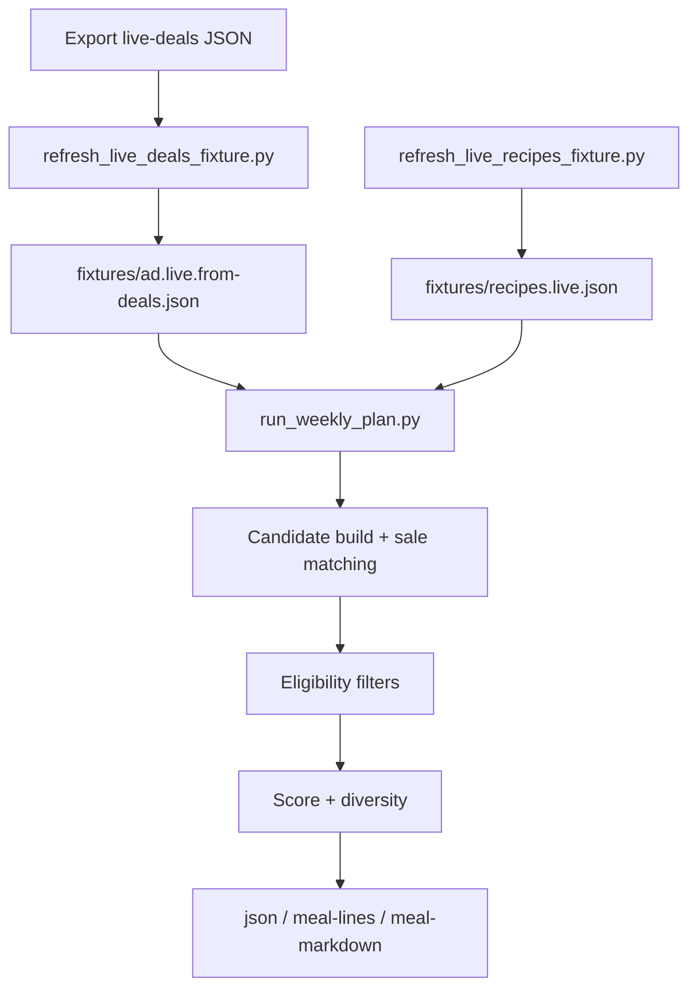

# Development Guide

This doc contains implementation details that are intentionally kept out of the main `README.md`.

## End-to-End Code Flow



## Script Responsibilities

- `scripts.refresh_live_deals_fixture.py`
  - converts browser-exported Kroger deals JSON into normalized ad fixture data
  - writes `fixtures/ad.live.from-deals.json`

- `scripts.refresh_live_recipes_fixture.py`
  - fetches recipe pages (`web` or `playwright` mode)
  - parses JSON-LD recipe payloads
  - excludes URLs from `fixtures/recipes.last-week.json`
  - writes `fixtures/recipes.live.json`

- `scripts.run_weekly_plan.py`
  - loads fixture or live adapters for ad + recipe inputs
  - maps recipe docs to candidates (`documents_to_candidates`)
  - applies eligibility, scoring, and diversity
  - emits `json`, `meal-lines`, or `meal-markdown`

## Data Shapes

- Ad fixture item:
  - `{ "name": "...", "price_text": "...", "category": "..." }`

- Recipe fixture item:
  - `{ "title","url","cuisine","protein","ingredients","rating","vote_count","prep_minutes","healthy" }`

- Planner output item:
  - `{ "title","url","rating","vote_count","score","cuisine","protein","sale_item_matches" }`

## Troubleshooting

- `written=0` on recipe refresh:
  - no recipe docs were accepted for this run
  - check Playwright install:
  - `npm install playwright && npx playwright install chromium`
  - rerun with:
  - `python3 -m scripts.refresh_live_recipes_fixture --mode playwright --target-count 100 --allow-shortfall`

- `used_backfill_from_excluded=true`:
  - strict novelty filter (exclude last week) removed all candidates
  - script backfilled from available docs to avoid empty fixture

- low recipe count:
  - keep `--allow-shortfall` enabled so planner can continue
  - retry later or on a different network when domains are unstable

Compact healthy refresh example:

```json
{
  "status": "ok",
  "mode": "playwright",
  "target_count": 100,
  "written": 72,
  "excluded_from_last_week": 24,
  "used_backfill_from_excluded": false,
  "allow_shortfall": true
}
```

## Useful Dev Commands

Run full tests:

```bash
python3 -m unittest discover -s tests -p "test_*.py"
```

Record HTTP captures for diagnostics:

```bash
python3 -m scripts.run_weekly_plan \
  --ad-mode web \
  --search-mode web \
  --web-fallback-to-fixture \
  --recipe-fixture fixtures/recipes.sample.json \
  --manual-fallback-fixture fixtures/ad.sample.json \
  --record-http-dir runs/http-captures \
  --record-metadata \
  --target-count 10
```
